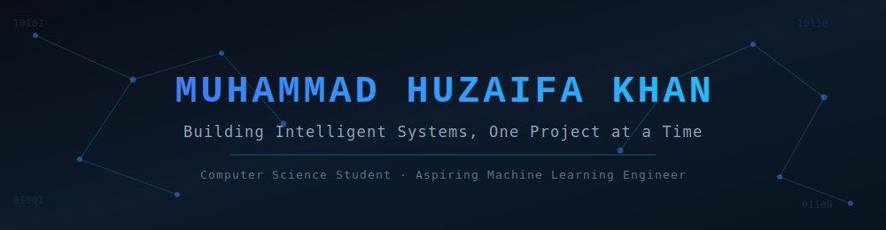
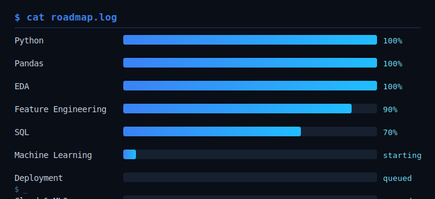

<div align="center">



<br/>

<a href="mailto:greatfeelings2000b@gmail.com"></a>
<a href="https://www.linkedin.com/in/muhammad-huzaifa-khan-aiml"></a>
<a href="https://www.kaggle.com/huzaifakhan200"></a>
<a href="https://github.com/huzaifa-khan-AiMl"></a>

<sub>⚠️ GitHub strips <code>target="_blank"</code> from README links for security — clicking these opens in the same tab. That's a platform-wide limitation, not something fixable from Markdown.</sub>

</div>

<br/>


## 💻 Terminal

<div align="center">

</div>

> **Note on the username above:** the typing widget is generated from a URL — it isn't reading your live shell — but the `void` handle mirrors the real WSL2 hostname on your Omen 16 setup, so it stays true to your actual environment rather than being a generic placeholder.


## 🧠 About Me

I'm a **Computer Science student** working toward becoming a **Machine Learning Engineer** — not by rushing through tutorials, but by understanding *why* a concept exists before learning *how* to use it.

```
╭──────────────────────────────────────╮
│   Understanding before               │
│   Implementation.                    │
│                                       │
│   Curiosity before                   │
│   Completion.                        │
╰──────────────────────────────────────╯
```

Every project on this profile follows the same rules:

- Understand before memorizing
- Explain every technical decision
- Build projects instead of collecting certificates
- Learn fundamentals before frameworks
- Stay consistent — one step every day


## 📈 Roadmap

<div align="center">

</div>


## 🛠 Tech Stack

<div align="center">

**Languages & Core**


**Data Analysis**


**Environment**


</div>

**Currently learning:** SQL · Feature Engineering · Machine Learning
**Up next:** Scikit-Learn · FastAPI · Docker · MLflow · AWS


## 📂 Featured Projects

<table>
<tr>
<td width="50%" valign="top">

### 📊 Used Cars Market Analysis
Professional EDA project covering:
- Data cleaning
- Feature engineering
- Statistical analysis
- Business insights

</td>
<td width="50%" valign="top">

### 🕸️ Web Scraper
Python automation with BeautifulSoup — extracts structured data and exports to CSV.

</td>
</tr>
<tr>
<td width="50%" valign="top">

### 🗂️ File Organizer
Script that automatically sorts files into folders by extension.

</td>
<td width="50%" valign="top">

### 🧩 LeetCode Journey
Every solution documents pattern recognition, algorithm choice, and time/space complexity — not just the answer.

</td>
</tr>
</table>


## 🎯 Current Focus

- Completing SQL
- Second end-to-end EDA project
- Machine Learning foundations
- Growing this portfolio


## 📊 GitHub Stats

<div align="center">


</div>

<div align="center">

</div>

> **About the streak showing 0:** these two widgets pull directly from GitHub's public contribution API using the **exact** casing `huzaifa-khan-AiMl` (GitHub usernames are case-insensitive for login, but these third-party widgets are not always forgiving of casing/caching — using one consistent casing everywhere fixes most zero-streak bugs). If it's still 0 after this, the two likely causes are: (1) contributions are private and "Include private contributions" isn't enabled in your GitHub profile settings, or (2) the streak-stats service's cache hasn't refreshed yet (it usually catches up within 24h).

<div align="center">

</div>


## 🐍 Contribution Snake

<div align="center">
<picture>
  <source media="(prefers-color-scheme: dark)" srcset="https://raw.githubusercontent.com/huzaifa-khan-AiMl/huzaifa-khan-AiMl/output/github-contribution-grid-snake-dark.svg" />
  <source media="(prefers-color-scheme: light)" srcset="https://raw.githubusercontent.com/huzaifa-khan-AiMl/huzaifa-khan-AiMl/output/github-contribution-grid-snake.svg" />
  
</picture>
</div>

> This image won't appear until the **"generate snake animation"** workflow (in `.github/workflows/snake.yml`) has run at least once — it needs Actions enabled and one push to `main` to fire. See the setup steps below.


## ⚔️ Terminal Sigil

*An original mark for the profile — not a copyrighted character, just terminal-style ASCII.*

```
              ▲
             ╱ ╲
            ╱   ╲
           ╱ ┌─┐ ╲
          ╱  │0│  ╲
         ╱   │1│   ╲
    ════╪════└─┘════╪════
         ╲         ╱
          ╲       ╱
           ╲     ╱
            ╲   ╱
             ╲ ╱
              ▼
     [ compile · run · learn ]
```


<div align="center">

### huzaifa@void:~$ ls repositories/

📁 used-car-market-analysis · 📁 web-scraper · 📁 file-organizer · 📁 leetcode-python

<br/>

**"Understanding before Implementation. Curiosity before Completion."**

⭐ Thanks for visiting.

</div>
